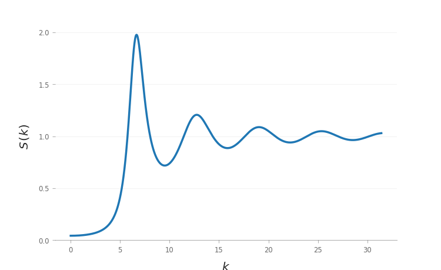

# LiquidsStrucure.jl

This library intended to provide a mean to compute the structure factor of a
variety of model liquids with different interaction potentials and under
different approximation schemes (e.g. Percus–Yevick closure for the
Ornstein–Zernike relation for a hard-sphere liquid) in the
[Julia](http://julialang.org) programming language.

## Status

So far, this library provides routines to calculate the structure factor of:

 - hard spheres under the [Percus–Yevick
   approximation](https://en.wikipedia.org/wiki/Percus–Yevick_approximation)
   for the [Ornstein–Zernike (OZ)
   equation](https://en.wikipedia.org/wiki/Ornstein–Zernike_equation),
 - hard spheres under the Percus–Yevick closure with [Verlet–Weis
   corrections](https://doi.org/10.1103/PhysRevA.5.939),
 - hard disks under the Rosenfeld FMT approximation,
 - dipolar hard spheres under the MSA approximation.
 - attractive hard spheres under the [Sharma-Sharma
   approximation](https://doi.org/10.1016/0378-4371(77)90151-0).

**TODO**

- [ ] Add more interaction potentials and approximation schemes

## Installation

`LiquidsStructure.jl` should work on Julia 1.0 and later versions and can be
installed from a Julia session by running

```julia
julia> ] add https://github.com/LANIMFE/LiquidsStructure.jl.git
```

## Usage

Once installed, run

```julia
using LiquidsStructure
```

The structure factor can be calculated by constructing a
`StructureFactor(::Liquid, ::ApproximationScheme)` object `S`, and then using
`S` as a function over the wavevector `k` (`S(k)`).

As an example, let us plot the structure factor for a hard spheres liquid with
a volume fraction `η = 0.4`, under the Verlet–Weis approximation scheme

```julia
julia> using LiquidsStructure
julia> using Plots
julia> η = 0.4;
julia> S = StructureFactor(HardSpheres(η), VerletWeis);
julia> plot(S, range(0, stop = 10π, length = 1024), label = "S(k)")
```



## Acknowledgements

This project was developed with support from CONACYT through the Laboratorio
Nacional de Ingeniería de la Materia Fuera de Equilibrio (LANIMFE).
